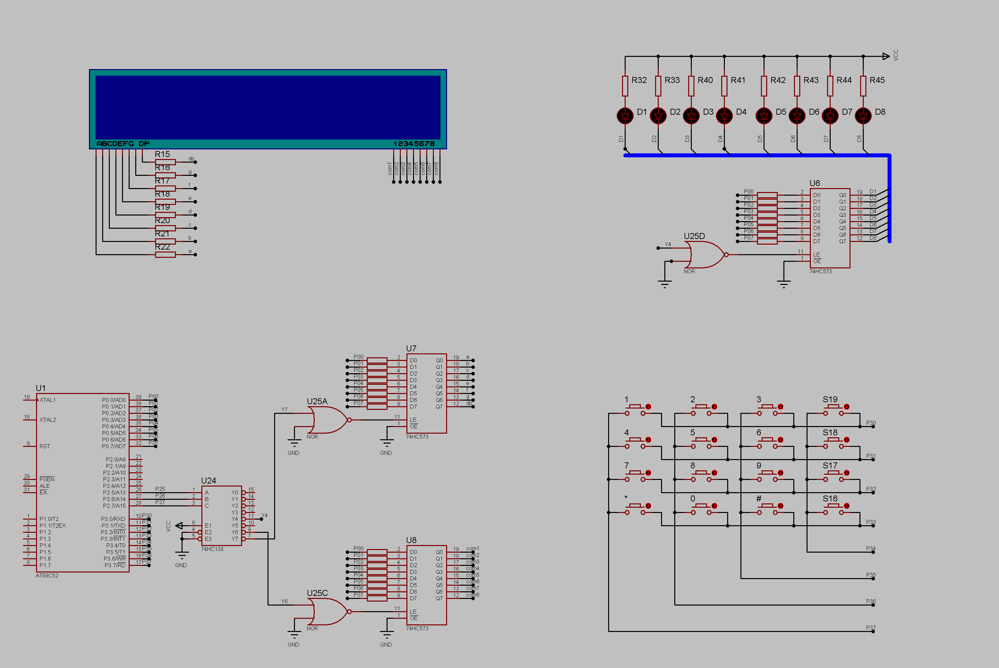
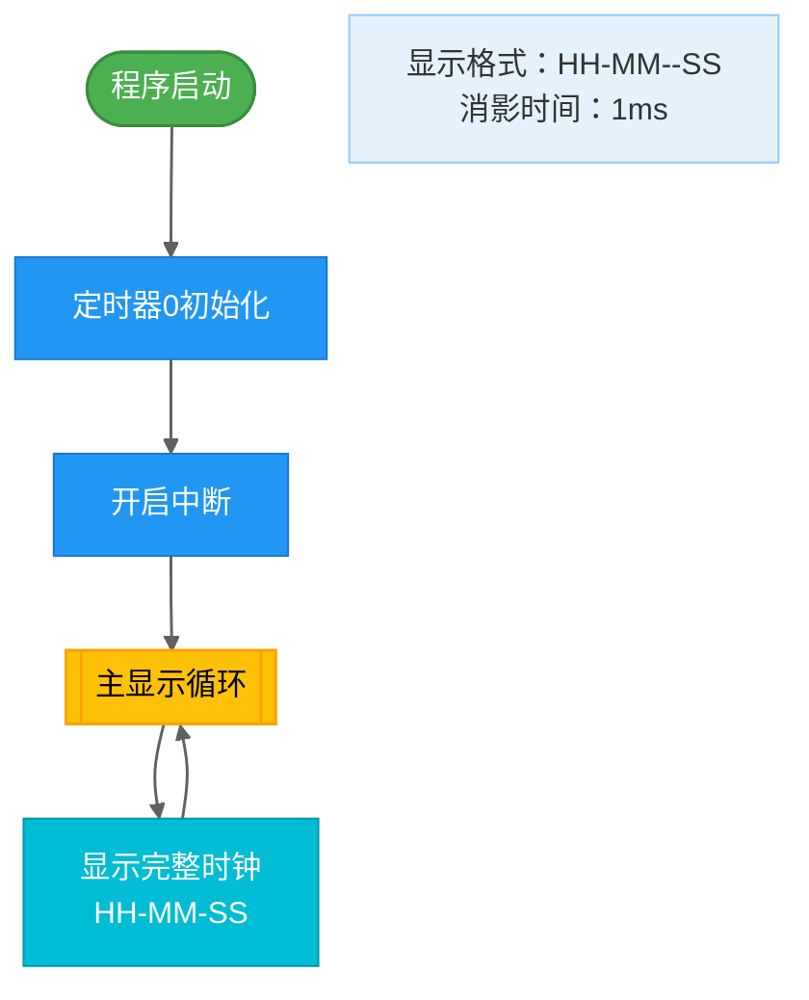
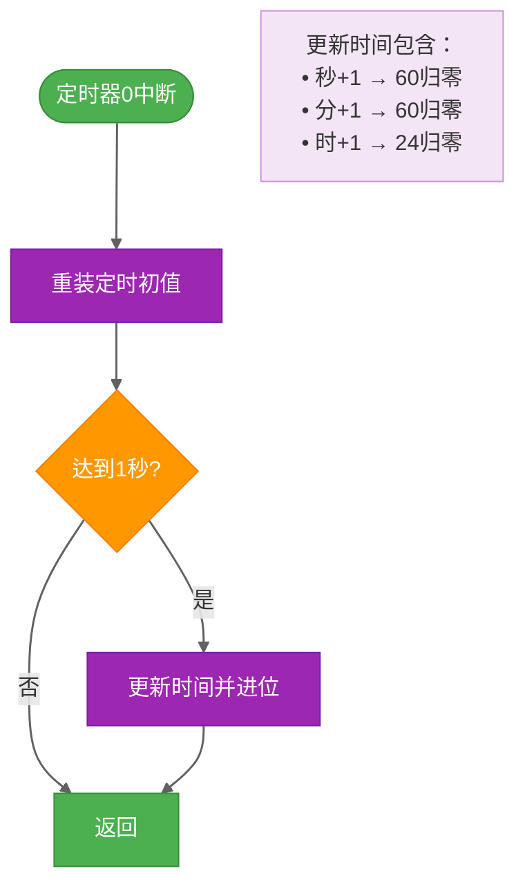

# STC89C52_Project
仓库包含了一些基础的52单片机项目，用于学习交流
---
title: "基于CT107D开发板的实验项目"
author: "YapengChen"
date: "6/10/2025"
---
# **这里是该项目的文档部分**

## 前言

首先CT107D开发板与普中A2开发板不尽相同，但后者更容易上手（友好）。
例如点亮一颗LED灯的程序是这样的：

```C
#include <regx52.h>
sbit LED = P2^0;
void main()
{
    while(1)
    {   
        LED = 0;
    }
}
```

而CT107D开发板在点亮P0口的一颗LED灯之前，需要操作138译码器和锁存器。

```C
#include <REGX52.H>
void main()
{
	while(1)
	{
		P2 &= 0x1F;  //清P27，P26，P25的位
		P2 |= 0x80;  //P2=10000000，对应138译码器的Y4=0
		P0 = 0xFE;   //P0.0给低电平
	}
}

```

还需注意的是普中A2开发板的8位数码管是共阴极，而CT107D是共阳极（高电平不亮）。

## 电路图



## 74HC138芯片

74HC138芯片有三位输入，在CT107D开发板上分别接P2.7，P2.6，P2.5.

八种可能的输入组合确定了$Y0-Y7$中的某位输出低电平，而其余位输出高电平。

|  输  |  入  |      | 输 | 出 |    |    |    |    |    |    |
| :--: | :--: | :--: | :-: | :-: | :-: | :-: | :-: | :-: | :-: | :-: |
| P2.7 | P2.6 | P2.5 | Y0 | Y1 | Y2 | Y3 | Y4 | Y5 | Y6 | Y7 |
|  0  |  0  |  0  | 0 | 1 | 1 | 1 | 1 | 1 | 1 | 1 |
|  0  |  0  |  1  | 1 | 0 | 1 | 1 | 1 | 1 | 1 | 1 |
|  0  |  1  |  0  | 1 | 1 | 0 | 1 | 1 | 1 | 1 | 1 |
|  0  |  1  |  1  | 1 | 1 | 1 | 0 | 1 | 1 | 1 | 1 |
|  1  |  0  |  0  | 1 | 1 | 1 | 1 | 0 | 1 | 1 | 1 |
|  1  |  0  |  1  | 1 | 1 | 1 | 1 | 1 | 0 | 1 | 1 |
|  1  |  1  |  0  | 1 | 1 | 1 | 1 | 1 | 1 | 0 | 1 |
|  1  |  1  |  1  | 1 | 1 | 1 | 1 | 1 | 1 | 1 | 0 |

在该项目中我们更多关心的只有那几个常用的状态：

| P2.7 | P2.6 | P2.5 |      Hexd      | 锁存器 |     功能     |
| :--: | :--: | :--: | :------------: | :----: | :----------: |
|  1  |  0  |  0  | **0x80** |   U6   | 控制8颗LED灯 |
|  1  |  1  |  1  | **0xE0** |   U7   | 数码管的段码 |
|  1  |  1  |  0  | **0xC0** |   U8   | 数码管的位码 |

要使用哪个功能得先确定对应P2的值

```C
P2 = (P2 & 0x1F) | 0x _ _；		//对应Hexd
```

## 74HC573锁存器

74HC573锁存器是八路透明D型锁存器，引脚有:
$D1-D7, LE, \overline{OE}, VCC, GND， Q0-Q7$ .

When $LE$ is **HIGH**, data at the $D_n$ inputs enter the latches. In this condition the latches are transparent (*透明的* ), i.e. a latch output will change state each time its corresponding D input changes.

When $LE$ is **LOW**, the latches store the information that was present an the D-inputs a set-up time preceding the **HIGH-to-LOW** transition of $LE$.

When $\overline{OE}$ is **LOW**, the contents of the 8 latches are available at the outputs.
When $\overline{OE}$ is **HIGH**, the outputs go to the high-impedance OFF-state. Operation of the $\overline{OE}$
input does not affect the state of the latches.

如果要给锁存器U6写入(锁存)数据**0xFE**需要先将$LE$(Latch Enable)拉高电平$LE=1$，这里$LE$
接$\overline{Y4}$，只需要让$Q2.7=1, Q2.6=0, Q2.5=0$,即**P2 = 0x80**，便有$LE = \overline{0} =1$.

这时锁存器U6进入透明状态。
输出端$Q0-Q7$的状态跟随输入端$D1-D7$的状态,其中$D0-D7$接$P0.0-P0.7$。

再给$LE$一个下降沿触发，就可以将$D1-D7$输入端
的数据**0xFE**锁存，此时$Q0-Q7$的值为：

| Q0 | Q1 | Q2 | Q3 | Q4 | Q5 | Q6 | Q7 |
| :-: | :-: | :-: | :-: | :-: | :-: | :-: | :-: |
| 0 | 1 | 1 | 1 | 1 | 1 | 1 | 1 |

之后再改变P0的值，并不会改变$Q0-Q7$的值(在当$LE$下一个高电平来之前)。

**此为锁存。**

*注意：$\overline{OE}$ (Output Enable)低电平有效。若$\overline{OE}$
接高电平，$Q0-Q7$处于高阻态。*

如果此时$Q0$接了一颗LED灯,那LED灯将会被点亮。


${\color{red} 至此，我们便完成了点亮一颗LED灯的任务。}$

## LED流水灯显示
```c
#include <REGX52.H>

unsigned int loc = 0;
unsigned char arr[] = {0xFE, 0xFD, 0xFB, 0xF7,
					   0XEF, 0xDF, 0xBF, 0x7F,
					   0xBF, 0XDF, 0xEF, 0xF7,
					   0xFB, 0xFD};
											 
void Timer0_Init(void)		//50ms@12.000MHz
{
	TMOD &= 0xF0;			//Set timer work mode
	TMOD |= 0x01;			//Set timer work mode
	TL0 = 0xB0;				//Initial timer value
	TH0 = 0x3C;				//Initial timer value
	TF0 = 0;				//Clear TF0 flag
	TR0 = 1;				//Timer0 start run
	ET0 = 1;				//Enable Time0 Interrupt
	EA  = 1;				//Enable All
	PT0 = 0;				//Priority Low
}

void main()
{
	Timer0_Init();
	while(1)
	{
		P2 = (P2&0x1F)|0x80;
		P0 = arr[loc];
	}
}

void Timer0() interrupt 1
{
	static unsigned int counter;
	TL0 = 0xB0;				
	TH0 = 0x3C;
	counter++;
	
	while(counter >= 10)
	{
		counter = 0;
		loc++;
		if(loc >= 14) loc = 0;
	}
	
}
```







